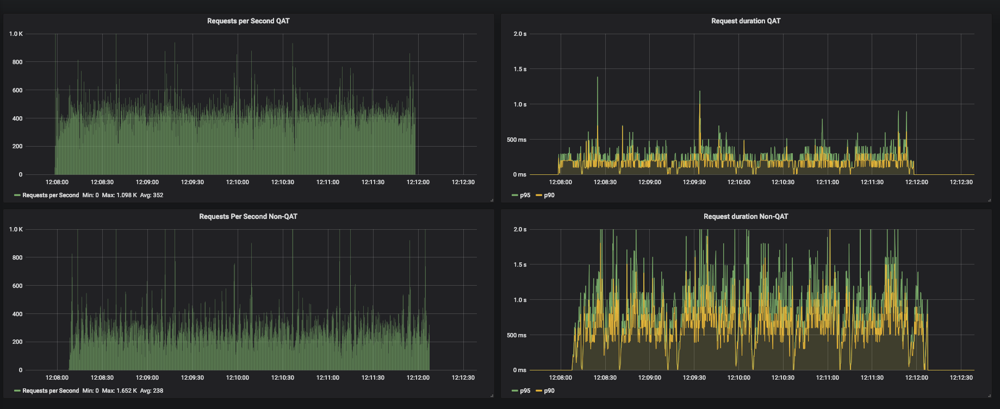

# Virtual Machines

This project uses [Vagrant tool][1] for provisioning a Virtual Machine
automatically. The [setup](setup.sh) bash script contains the
Linux instructions to install dependencies and plugins required for
its usage. This script supports two Virtualization technologies
(Libvirt and VirtualBox).

    $ ./setup.sh -p libvirt

Once Vagrant is installed, it's possible to provision an All-in-One
Kubernetes cluster using the following instruction:

    $ vagrant up

## Enable Grafana Dashboard

The [sample_plugin.sh](sample_plugin.sh) bash script installs and
configures a grafana dashboard which makes easier to compare the
request per second and request duration results of a single Nginx
server that is using QAT.

## License

Apache-2.0

[1]: https://www.vagrantup.com/
